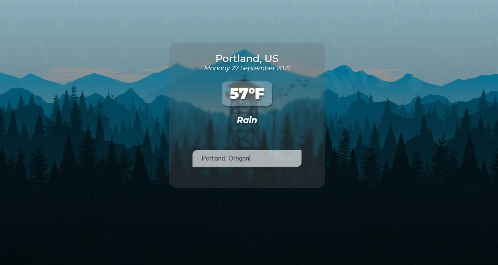

# Firewatch Weather Widget

## Created an weather app/widget with design using wallpaper art from the video-game `Firewatch`.

Click <a href='#' target='_blank'>here</a> to view the project live.

## Requirements

#### You will need `node`, `yarn`, and `vue` to run this application locally.

## Installation and Setup Instructions

#### FIRST: Make sure to read through this `README.md` fully and verify that you have everything required

#### 1. Create `.env` file in root folder, and set `VUE_APP_API_KEY` equal to your API key for the OpenWeatherMapAPI. If you do not already own a key for this API, you can sign up for one for free by clicking <a href='https://openweathermap.org/appid' target='_blank'>here</a>.

#### 2. Run `yarn add` or just run `yarn` command inside root folder for this project, to install dependancies.

#### 3. Launch Application using `yarn serve` command.
